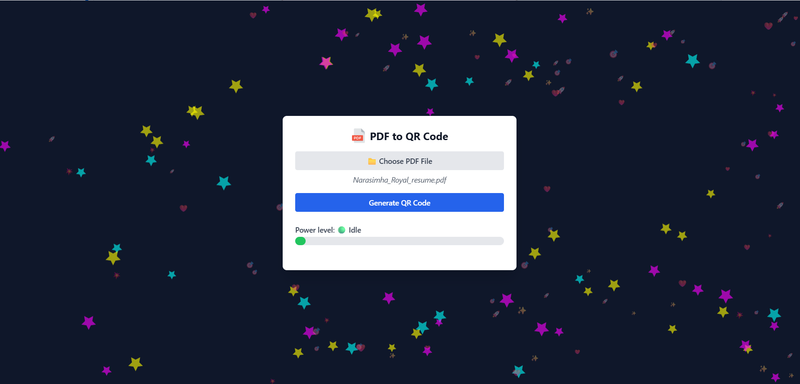
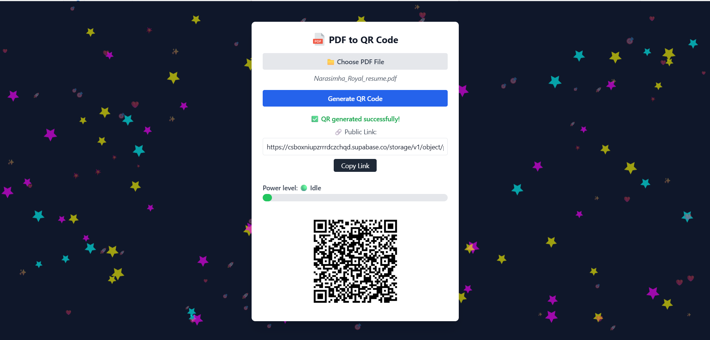
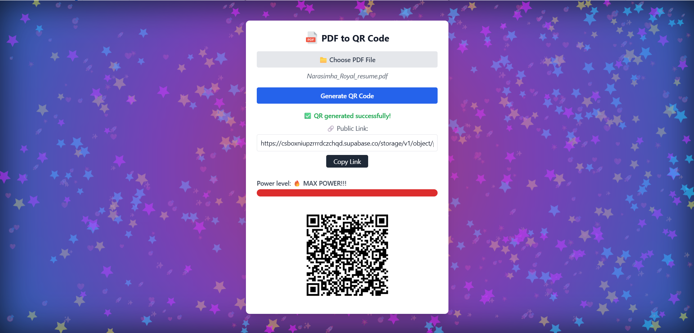

<h1 align="center">📄 PDF to QR – Resume Sharer with a Twist</h1>

Upload. Scan. Done. And maybe… have a little fun while you're at it.

---

### Live Demo

👉 [Click here to try it out](https://pdf-to-qr.netlify.app/)

---

### ⚠️ Heads-Up About Hosting

This project uses **Supabase’s free tier** to host uploaded PDF files.  
If there’s **no activity for 1 week**, Supabase may temporarily pause the storage.

> If the **QR code doesn’t load** or the **app seems broken**, it’s likely just sleeping 💤  
> Try again later, or star the repo and raise an issue, I’ll manually wake it up 👨‍💻

---
### 🛠 Tech Stack

  
  
  
  
  
  

---

### 💡 Why I Built This

Most QR generators ask for emails, which feels like data theft in disguise.  
This tool is my personal solution to a real-world need: **share my resume instantly** with zero friction, no spam, and no third-party traps.

---

### ✨ Features

- **📄 PDF Upload** – Upload your resume (or any PDF)
- **🔗 Instant Link** – Generates a public link in seconds
- **🔲 QR Code Generation** – Instantly sharable
- **📱 Mobile-Friendly UI** – Optimized for phones and tablets
- **🌌 Interactive Background** – A starry particle playground
- **⚡ Power Meter** – Tracks your click intensity
- **💬 Fun Messages** – Random alerts for playful overloads

---

### 📎 Use Cases

- Share your **resume** at meetups or career fairs
- Deliver PDF resources instantly via QR
- Boost your **personal branding** with interactive tech

---
###  How It Works

1. Select your PDF file.
2. Click **Generate QR Code**.
3. App uploads the file to Supabase and shows:
   - Public link
   - QR code for instant access
4. Open on any device, no login needed.

---

### 📸 Screenshots

| Home Page | 
|-----------|
|  
|QR Generated |

|Partical Game |

---
###  Future Enhancements

---

### 🙋 Made By

**Narasimha Royal**  
_Masters in Computer Science @ University of Houston_  
Building for fun, function, and the future 🛠

---

### ⏳ Coming Soon

- [ ] 📥 **QR-to-Download** mode (Part 2 of the project)

---
